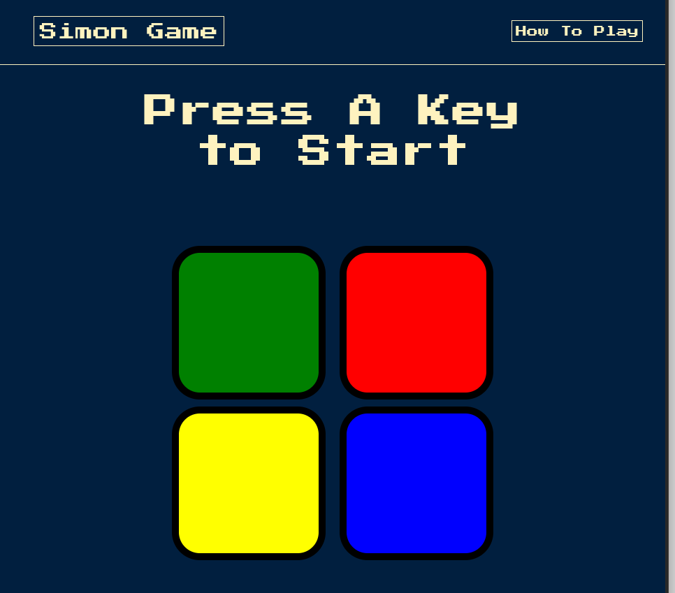

# Simon Game

The principle of the game is simple: the player have to memorize the series of illuminated keys and reproduce it. the purpose of the game is to reproduce the longest series of colors / sounds randomly generated by the Simon, it's an endless game!

game: [simon-game.com](https://thenew-programer.github.io/Simon-Game/)

